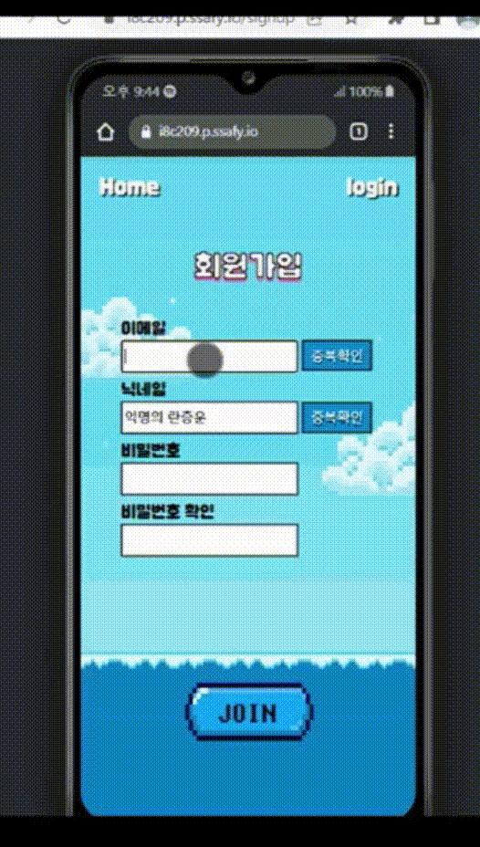
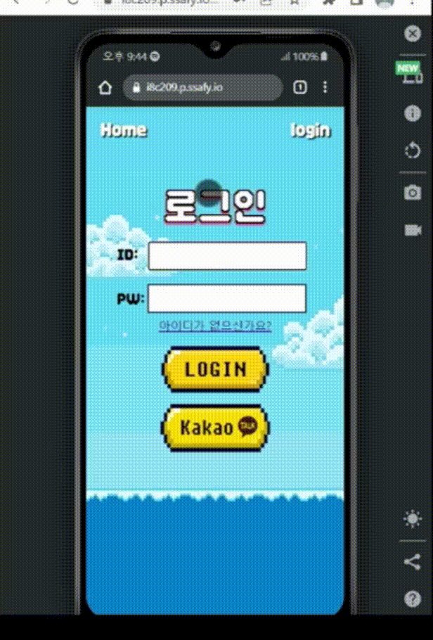
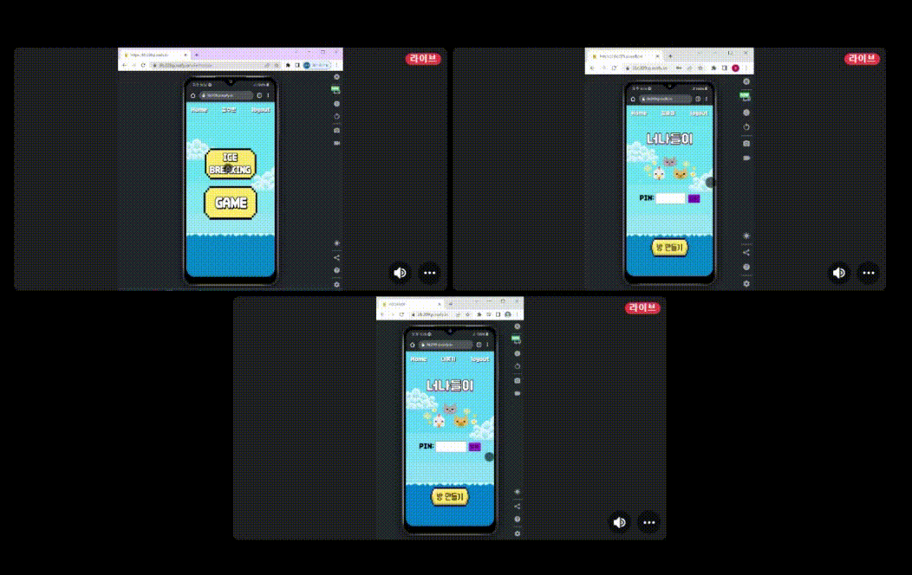
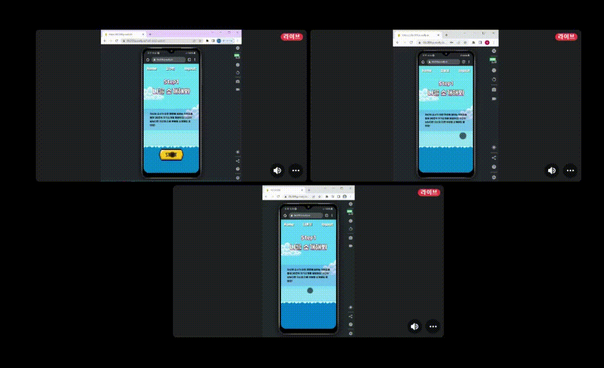
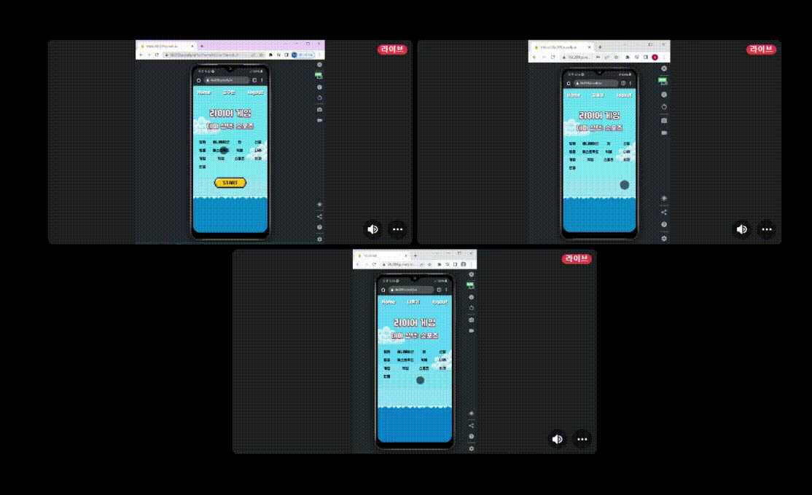
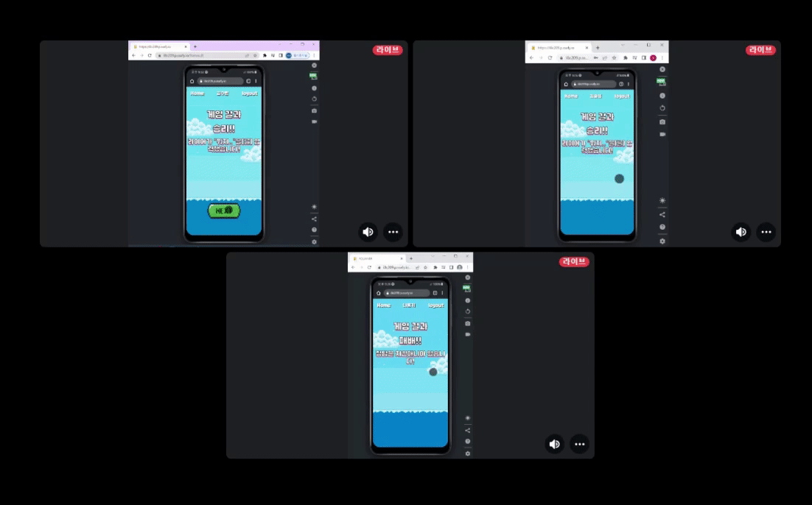

## 🦒 너나들이 서비스 화면

### 회원가입
- 이메일,닉네임,비밀번호를 입력해야합니다.
- 닉네임은 랜덤으로 주어지며 본인이 직접 작성도 가능합니다.
- 이메일과 닉네임은 타 사용자와 중복될 수 없습니다.
- 비밀번호는 숫자와 특수문자를 포함해야 합니다.

 

### 로그인
- 이메일과 비밀번호를 입력해야합니다.
- 카카오톡 로그인이 가능합니다.

 

### 아이스브레이킹

 

#### 인트로
- 메인화면에는 방만들기와 PIN번호로 참여하기 버튼이 있습니다.
- 한명이 방의 인원수를 설정하고 방을 만들면 나머지 참여자들을 PIN을 입력해 방에 참여합니다.
- 방을 만들때 설정한 인원수가 다 접속해야 NEXT버튼이 활성화 됩니다.
- 모두가 모이면 3가지 설문을 작성합니다.(이 설문은 Step2에서 퀴즈로 활용됩니다.)
- 설문을 모두 작성하면 Step1을 시작할 수 있습니다.

 

#### Step1. 나를 소개해봐
- 참여자들이 한명씩 돌아가며 30초 동안 자기소개를 합니다.
- 자기소개를 할 때는 랜덤으로 키워드가 주어지고 발표자는 키워드를 통해 자신을 소개합니다.

 

#### Step2. 나를 찾아봐
- 인트로에서 작성한 설문을 바탕으로 퀴즈가 나오게 됩니다.
- 참여자들은 퀴즈의 답을 추측하며 서로 대화하고 정답보기 버튼을 눌러 답을 확인합니다.
 

 

#### Step3. 밸런스 게임
- 고르기 힘든 두가지의 선택지를 가지고 대화를 나눕니다.
  

 

#### Step4. 라이어 게임 
- 13가지 테마중에서 한 가지를 골라 게임을 시작합니다.
- 참여자중 한명만 라이어가 되어 키워드를 볼 수 없습니다.
- 키워드와 관련된 대화를 하고 누가 라이어인지 추측합니다.
- 투표를 통해 라이어를 선정합니다.
- 라이어가 아닌 참가자가 라이어로 선정되면 라이어가 승리합니다.
- 라이이인 참가자가 라이어로 선정되면 라이어는 키워드를 추측하여 입력합니다.
- 라이어가 키워드를 맞추면 라이어가 승리하고 틀린 경우 라이어가 패배하게 됩니다. 

 

### 아웃트로
- 참가자들의 닉네임이 일렬로 화면에 표시됩니다.
- 처음 시작부터 끝날 때까지 몇초동안 활동을 했는지 나타납니다.
- 개발자들의 이름이 표시됩니다.

 

### 폭탄돌리기
- 게임모드에서는 폭탈돌리기 게임이 추가로 이용 가능합니다.
- 방장은 게임 시간을 설정하고 게임을 시작합니다.
- 화면에 보이는 키워드에 대해 자신의 얘기를 하고 폭탄을 넘깁니다.
- 대답하기 힘든 키워드는 단어바꾸기 버튼을 눌러 변경이 가능합니다.
- 시간이 종료될 때 폭탄을 가지고 있는 사용자가 패배하게 됩니다. 

